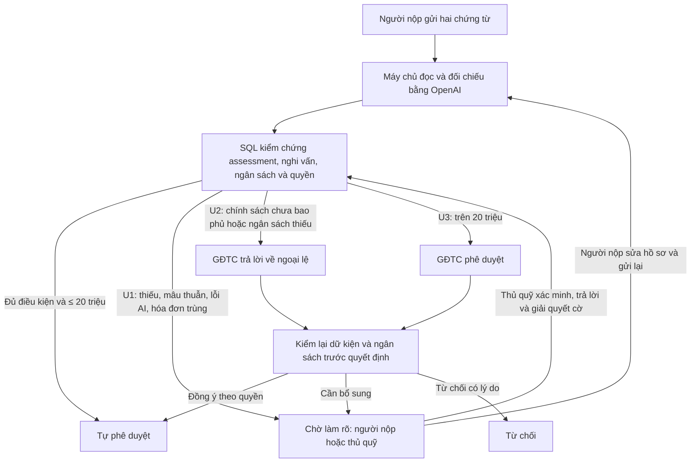

# FinRef · The Escalation Referee

FinRef xử lý đề nghị thanh toán: tự hoàn tất hồ sơ thường quy và dừng để hỏi đúng người khi có nghi vấn, ngoài chính sách hoặc vượt thẩm quyền. Bản hackathon áp dụng **chính sách mẫu FIN-DEMO-1** và hạn mức tự phê duyệt **20.000.000 VNĐ (bao gồm đúng 20 triệu)**. Sản phẩm dừng ở phê duyệt, không chuyển tiền.

## Trải nghiệm

- Website đã có trước thay đổi này: <https://ctrlc-ctrlv-hackathon-two.vercel.app>. Bản nâng cấp trong repository cần migration, cấu hình key và deploy mới để xuất hiện ở đó.
- `demo.html`: không cần tài khoản/key; mô phỏng bằng checkbox và localStorage. **Verify 5 ca** hiển thị riêng 3 ca tự xử lý và 2 ca chuyển tiếp, trạng thái, lý do, người nhận và câu hỏi. Không gọi AI hoặc ghi dữ liệu online.
- `index.html`: ba vai trò Supabase; hai chứng từ riêng tư được máy chủ lấy từ Storage rồi gửi OpenAI. Kết quả được gắn với đúng tài khoản, nội dung form và file; SQL quyết định và lưu nhật ký.

## Workflow



**U1 được ưu tiên hơn U2/U3.** Không tự kết luận hợp lệ khi cờ nghi vấn còn mở. U2 không đồng nghĩa vi phạm: chỉ người có quyền quyết định ngoại lệ. Sau khi thủ quỹ xác minh, SQL đánh giá lại thay vì tự coi hồ sơ là được duyệt. Ngân sách có thể thay đổi trong lúc chờ GĐTC, nên được kiểm lại khi quyết định.

## Chính sách mẫu

| Mã ngân sách | Danh mục | Tổng ngân sách |
|---|---|---:|
| MKT-OPS-2026 | In ấn | 100.000.000 VNĐ |
| OPS-2026 | Văn phòng phẩm | 100.000.000 VNĐ |
| HR-2026 | Đào tạo | 100.000.000 VNĐ |

Chi tiết điều kiện, ngoại lệ và giới hạn: [POLICY.md](POLICY.md). Đây không phải quy định tài chính thật của nhóm/doanh nghiệp.

## Công nghệ và chạy local

JavaScript thuần; Node.js 22+; Vercel Node Function; Supabase Auth/PostgreSQL/Storage; OpenAI Responses API với Structured Outputs. Không có thư viện runtime bổ sung. PGlite chỉ dùng kiểm thử PostgreSQL.

```sh
corepack enable
pnpm install --frozen-lockfile --ignore-scripts
pnpm test
# Cấu hình SUPABASE_URL và SUPABASE_ANON_KEY trước khi build
pnpm build
pnpm start
```

`pnpm start` phục vụ frontend tại <http://127.0.0.1:8124>. API AI cần môi trường Vercel (Preview/Production hoặc `vercel dev`); khi không có API, hồ sơ vẫn được gửi vào U1 để xử lý thủ công. Xem [HUONG-DAN-ONLINE.md](HUONG-DAN-ONLINE.md) để nâng cấp Supabase và cấu hình OpenAI key.

## Kiểm thử và bằng chứng Sprint 1

- 15 ca bộ xử lý mẫu, gồm dữ kiện thiếu, ngoài chính sách, vượt quyền và mốc biên. Verify chạy cùng hàm xử lý demo, không chỉ đếm mã phân loại.
- Test AI/schema và API: đọc đúng file từ Storage, kiểm quyền/rate limit, nghi vấn không được CLEAR, lỗi/refusal không tạo assessment thành công, bí mật không xuất hiện trong phản hồi.
- Test PostgreSQL PGlite: SQL migration và RPC thật, quyền người dùng, assessment khớp dữ liệu/đã dùng/hết hạn, mốc 20 triệu, U1/U2/U3, hóa đơn trùng, ngân sách, nhật ký.
- `scripts/test-browser.cjs`: Chrome + PostgreSQL cục bộ, mạng Supabase/OpenAI giả lập; kiểm tra chuỗi thao tác và layout. Có thể dùng Playwright đã cài bằng biến `PLAYWRIGHT_PATH`, và `CHROME_PATH` cho trình duyệt. Chi tiết kết quả ở [VALIDATION.md](VALIDATION.md).

Chưa kiểm thử dịch vụ OpenAI/Supabase thật trong lần bàn giao này. Test cục bộ không chứng minh deployment hoặc chất lượng đọc chứng từ thật.

## Giới hạn cần biết

- Hình dấu/chữ ký không chứng minh tài liệu thật. Chỉ dùng chứng từ giả trong hackathon. Mô hình có thể đọc sai hoặc bị nội dung chứng từ đánh lừa; quy tắc/kiểm quyền không loại bỏ mọi rủi ro nhận thức của AI.
- Ngưỡng 0,9 là điều kiện thận trọng từ tự đánh giá của mô hình, không phải xác suất chính xác đã hiệu chuẩn. Ca không đạt được chuyển U1.
- Định danh hóa đơn trùng dựa trên nhà cung cấp + số hóa đơn; chưa có mã số thuế/sổ cái để đối soát doanh nghiệp.
- Thiếu key/lỗi dịch vụ/không đọc rõ thì không tự duyệt. Hai file tối đa 10 MB/file; API chỉ nhận đường dẫn và form, không gửi base64 lớn qua request của Vercel.
- Giới hạn 6 lượt/phút và 100 lượt/ngày/tài khoản; nên dùng tài khoản nhóm, tắt tự đăng ký và đặt giới hạn chi phí OpenAI riêng.
- Tệp tải lên trước khi gửi thất bại có thể thành tệp mồ côi. Chưa có chức năng thanh toán, email, quản lý chính sách/ngân sách qua UI hoặc dọn dữ liệu tự động.

## Làm việc nhóm

Tạo nhánh → `pnpm test` và build → review → PR → merge sau khi kiểm thử Preview. Không đưa `.env`, `.local/accounts.txt`, OpenAI key hoặc service role key lên GitHub. Khi thay SQL, cung cấp migration và kiểm thử; không chạy lại schema gốc trên database đã có.
